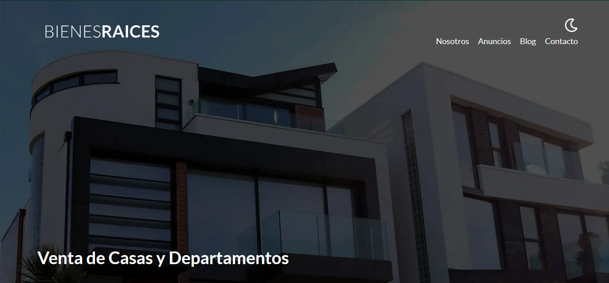
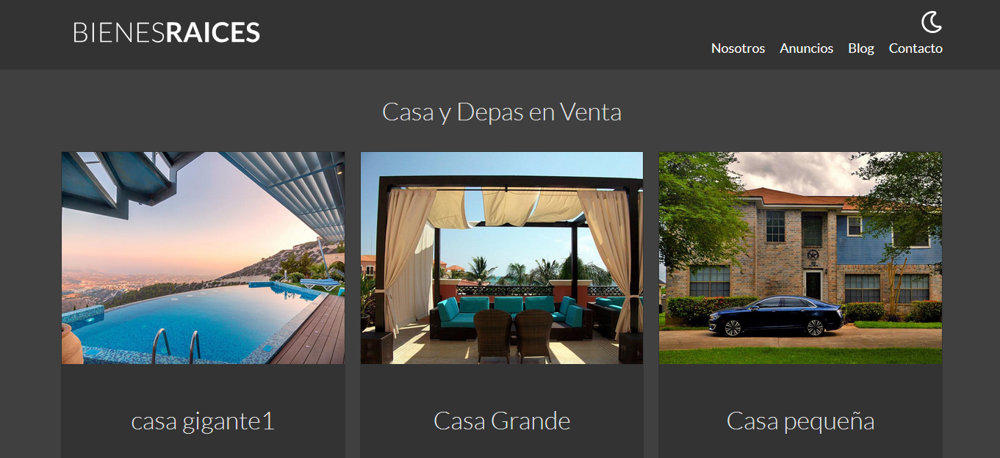
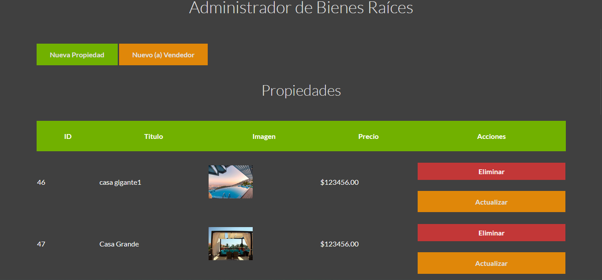

# MVC-BienesRa-ces

## Proyecto con php utilizando Model View Controller para crear, actualizar propiedades y vendedores

## Que cosas se implementarón

1. ### Aplicar el Model View Controller
2. ### Utilizar Cruds para agregar, actualizar o eliminar propiedades y vendedores.
3. ### Incorporar mailTrap para simular el envio de emails.
4. ### Para validar que la información del usuario, propiedades y vendedores aparezcan utilize TablePlus
5. ### Continuar trabajando con sass, y compilar css, js mediante el gulpFile

## Nota

### Probe subir el sitio web en diversos servidores pero hasta el momento no he tenido exito espero en un futuro poder realizar esto, para qur todos puedan visitar la página

## Imágenes

## Tecnologías utilizadas

&nbsp;
&nbsp;
&nbsp;
&nbsp;
